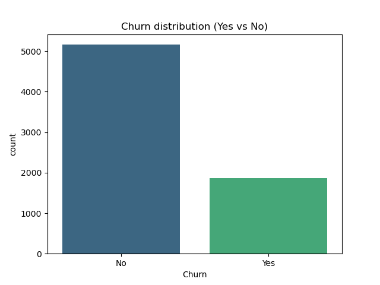
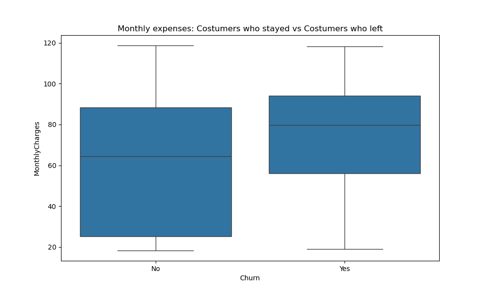
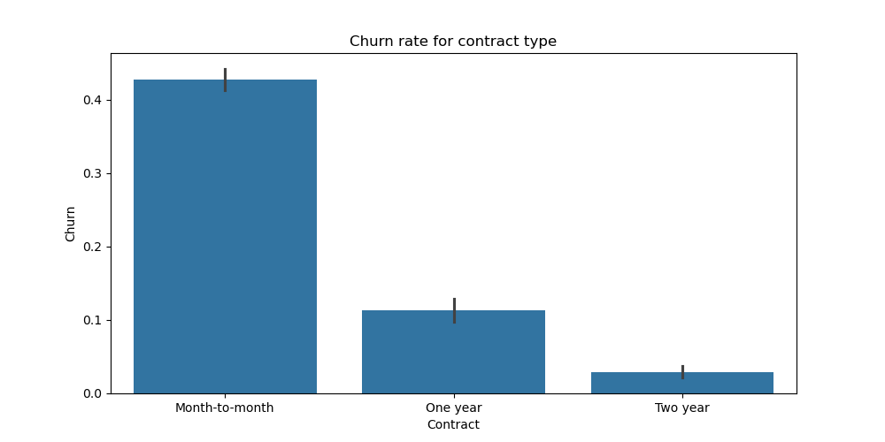
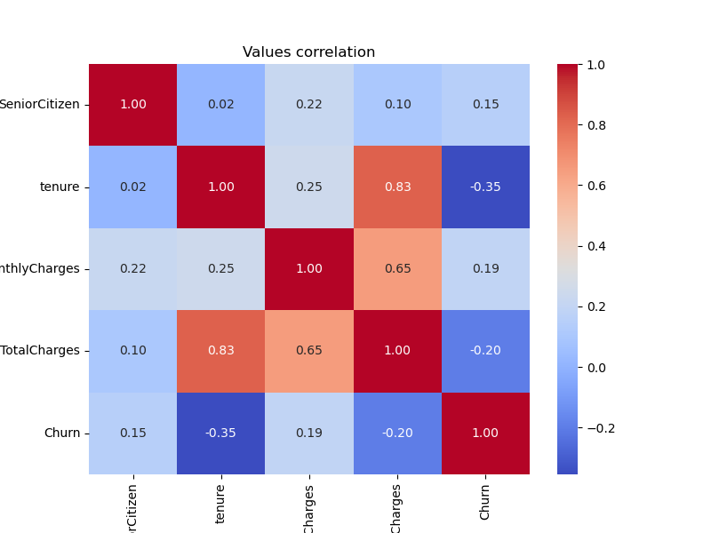

# 📊 Telco Customer Churn Prediction

This project applies Machine Learning to identify customers at high risk of churning for a telecommunications company. By analyzing behavior and contract data, we developed a model capable of signaling potential cancellations before they happen.

## 🎯 The Goal
The primary objective was to maximize **Recall** for the churn class. In a business context, it is more valuable to identify a customer who *might* leave (even if they don't) than to miss a customer who is *definitely* leaving.

---

## 📈 Data Visualization & Insights

### 1. Churn Distribution

* **Insight:** The dataset is imbalanced, with roughly 26% of customers churning. This required specific techniques (like class weighting) to ensure the model didn't become biased toward the majority class.

### 2. Monthly Expenses vs. Churn

* **Insight:** Customers who churn tend to have higher monthly charges. This suggests that price sensitivity is a major driver for leaving the service.

### 3. Impact of Contract Type

* **Insight:** Customers with "Month-to-month" contracts have a significantly higher churn rate compared to one or two-year contracts. Loyalty programs should focus on migrating customers to longer-term agreements.

### 4. Feature Correlation

* **Insight:** A strong negative correlation between **Tenure** and **Churn** shows that the longer a customer stays, the less likely they are to leave.

---

## 🤖 Machine Learning Approach

During development, the initial model suffered from **Convergence Issues** due to the wide range of numerical values (like Total Charges). 

### Key Technical Solutions:
- **Feature Scaling:** Applied `StandardScaler` to normalize numerical data, allowing the Logistic Regression to converge.
- **Handling Imbalance:** Used `class_weight='balanced'` to force the model to pay more attention to the churn cases.

---

## 🏆 Final Outcome: The 81% Breakthrough

### Confusion Matrix

Our final model achieved a **Recall of 0.81 (81%)** for the Churn class.

**What does this mean for the business?**
- Out of every 100 customers who are actually planning to leave, **our model successfully flags 81 of them.** - This enables the Retention Team to take proactive measures (discounts, loyalty calls, or service upgrades) for the vast majority of at-risk clients.
- While the trade-off is a lower Precision (more false alarms), the cost of losing a customer far outweighs the cost of a retention campaign, making this **an optimized solution for high-impact business decisions.**

---
*Project developed as part of a Data Science Portfolio.*
